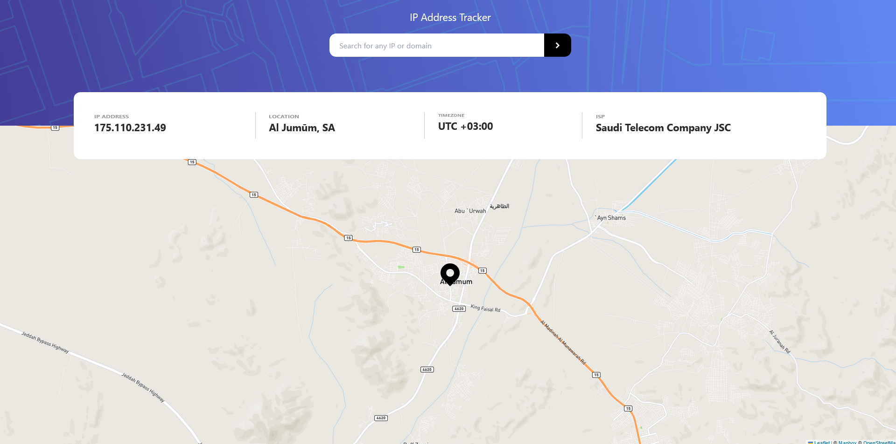
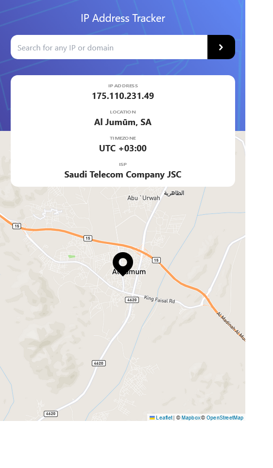

# Frontend Mentor - IP address tracker solution

This is a solution to
the [IP address tracker challenge on Frontend Mentor](https://www.frontendmentor.io/challenges/ip-address-tracker-I8-0yYAH0).
Frontend Mentor challenges help you improve your coding skills by building realistic projects.

## Table of contents

- [Overview](#overview)
    - [The challenge](#the-challenge)
    - [Screenshots](#screenshots)
    - [Links](#links)
- [My process](#my-process)
    - [Built with](#built-with)
    - [What I learned](#what-i-learned)
    - [Continued development](#continued-development)
    - [Useful resources](#useful-resources)
- [Author](#author)

**Note: Delete this note and update the table of contents based on what sections you keep.**

## Overview

### The challenge

Users should be able to:

- View the optimal layout for each page depending on their device's screen size
- See hover states for all interactive elements on the page
- See their own IP address on the map on the initial page load
- Search for any IP addresses or domains and see the key information and location

### Screenshots

### Links

- Solution URL: [GitHub](https://github.com/Yazeed-Idris/ip-address-tracker)
- Live Site URL: [GitHub Pages](https://yazeed-idris.github.io/ip-address-tracker/)

## My process

### Built with

- [Vue](https://v3.vuejs.org//) - JS library
- [Leaflet](https://leafletjs.com) - JS Library for interactive maps
- [Vite](https://vitejs.dev/) - JS Bundler
- [TailwindCSS](https://tailwindcss.com/) - Utility CSS framework
- [gh-pages](https://www.npmjs.com/package/gh-pages) - JS package for publishing websites on GitHub pages

### What I learned

In this challenge, I learned how to work with maps on the web and how to display them nicely to the user. Also, I
learned how to customize the map by adding pins on the desired location.

### Continued development

At this stage, the website has some performance bugs that needs to be fixed for the map component. Moreover, the design
is not very responsive and needs to be refactored.

### Useful resources

- [Vue 3 Docs](https://v3.vuejs.org/) - This helped me understand the basics of Vue 3.
- [Stack Overflow](https://stackoverflow.com/) - This site is the first place I look for answers about a problem I'm
  facing.
- [Leaflet Docs](https://leafletjs.com/reference.html) - The leaflet docs are well organized, and they have clear examples of each component of the library.
- [TailwindCSS Docs](https://tailwindcss.com/docs) - This has all the classes I used in the projects.
- [YouTube Tutorial](https://www.youtube.com/watch?v=z-hhIrLqYM0&t=2177s&ab_channel=JohnKomarnicki) - This video solves
  the entire challenge. So, if you get stuck it will help you.

## Author

- Github - [@Yazeed-Idris](https://github.com/Yazeed-Idris)
- Frontend Mentor - [@Yazeed-Idris](https://www.frontendmentor.io/profile/Yazeed-Idris)
- LinkedIn - [@Yazeed Idris](https://www.linkedin.com/in/yazeed-idris/)
